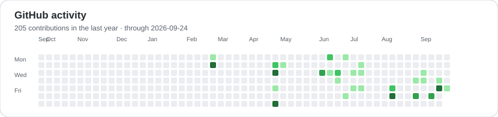
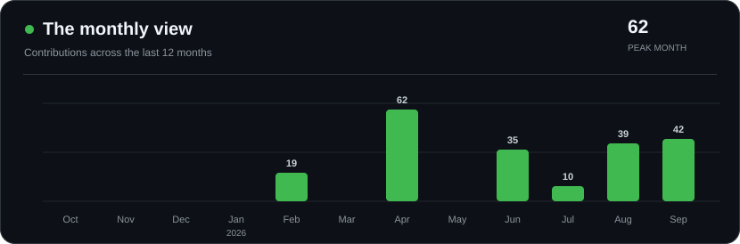

<h1 align="center">Aleksandr Medvedev</h1>

<strong>ML systems · LLM evaluation · semantic search</strong> 
Building useful AI systems, from reproducible experiments to working applications.

  <a href="https://medvax-ai.github.io/">Portfolio</a> ·
  <a href="mailto:medvedguk@gmail.com">Email</a> ·
  <a href="https://orcid.org/0009-0008-9941-4428">ORCID</a>

---

I work on retrieval, model evaluation, and the engineering that makes ML experiments repeatable and usable beyond a notebook.

## Working with

- **Modeling & retrieval:** Python, PyTorch, Hugging Face Transformers, scikit-learn, NumPy, FAISS
- **Applications & data:** FastAPI, PostgreSQL, Docker
- **Experiments & delivery:** DVC, MLflow, Git, GitHub Actions, Linux

## Selected projects

| Project | What it does |
| :--- | :--- |
| **[SemanticSplat](https://beyond-proximity-public.vercel.app/)** | Natural-language search over 3D scene evidence. The live site includes the method, paper, and results. |
| **[BudgetRoute-LLM](https://github.com/MedvAx-AI/budgetroute-llm)** | Cost-aware routing, retrieval, benchmarking, and serving for local language models. |
| **[Yacht Resistance MLOps Pipeline](https://github.com/MedvAx-AI/pmldl-yacht-mlops)** | An automated ML pipeline with DVC, MLflow, FastAPI, and a Dockerized prediction app. |

### In progress

**[Reliable Image Classification with Confidence Rejection](https://github.com/MedvAx-AI/Reliable-Image-Classification-with-Confidence-Rejection)** — a team study of confidence-based rejection, calibration, and corruption robustness. Currently at the planning and experimental-protocol stage.

## GitHub activity

## Contact

Based in **Innopolis, Russia**. I am interested in ML research, evaluation, retrieval, and applied LLM internships. Remote work is preferred; I am open to discussing relocation.

**Email:** [medvedguk@gmail.com](mailto:medvedguk@gmail.com)
