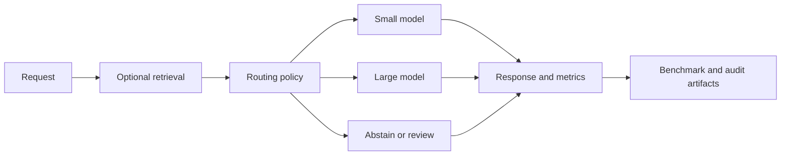

# Aleksandr Medvedev

**Applied AI student at Innopolis University · LLM evaluation · semantic search · reproducible ML**

I build ML systems and test their claims against held-out data, clear baselines, and measured costs. My recent work covers local language-model routing, natural-language search in 3D scenes, and an end-to-end MLOps pipeline.

[Portfolio](https://medvax-ai.github.io/) · [Email](mailto:medvedguk@gmail.com) · [ORCID](https://orcid.org/0009-0008-9941-4428)

## Working with

Python, PyTorch, Hugging Face Transformers, scikit-learn, NumPy, FAISS, FastAPI, PostgreSQL, DVC, MLflow, Docker, Git, GitHub Actions, and Linux. The project links below show where I used each tool and what was measured.

## Selected projects

### [SemanticSplat — graph-pruned search for 3D digital twins](https://beyond-proximity-public.vercel.app/)

Team research on grounding natural-language queries in captured 3D scene evidence. A semantic hierarchy narrows candidate objects and views before retrieval. The [live project site](https://beyond-proximity-public.vercel.app/) includes the method, paper, dataset manifests, frozen metrics, and reproduction steps.

- Evaluated graph traversal against flat search on **five team-captured scenes and 150 queries** using the same semantic records and scorer.
- Graph traversal checked **75.5% fewer views** and used **68.2% fewer estimated context tokens** on average.
- The tradeoff is visible: on **125 queries with verified view labels**, graph hit@1 was **0.680** versus **0.768** for flat search. The current result supports lower retrieval cost, not better hit accuracy.

[Explore the results](https://beyond-proximity-public.vercel.app/#results) · [Read the paper](https://beyond-proximity-public.vercel.app/assets/semanticsplat-paper.pdf) · [Inspect the frozen metrics](https://beyond-proximity-public.vercel.app/data/internal-metrics.json)

### [BudgetRoute-LLM — quality-aware local model routing](https://github.com/MedvAx-AI/budgetroute-llm)

A research implementation combining small/large language-model selection, retrieval, confidence cascades, abstention, a FastAPI service, and reproducible evaluation.

- Collected **500 paired MMLU examples** for Qwen2.5-0.5B/1.5B, with **100 untouched held-out questions** for the routing comparison.
- Measured accuracy, latency, route share, and calibration. The learned router scored **51%** versus **53%** for always-large on the held-out set, with **no latency gain**. The negative result is documented rather than presented as a win.
- Added traceable semantic retrieval with dense embeddings, FAISS exact/HNSW search, source metadata, and document/chunk IDs.

The routing and evaluation path, simplified from the [repository architecture](https://github.com/MedvAx-AI/budgetroute-llm/blob/main/docs/architecture.md):

[Repository](https://github.com/MedvAx-AI/budgetroute-llm) · [Held-out benchmark and limitations](https://github.com/MedvAx-AI/budgetroute-llm/blob/main/reports/benchmarks/qwen25-mmlu-500-learned-rtx3060.md)

### [Yacht Resistance MLOps Pipeline — data to serving](https://github.com/MedvAx-AI/pmldl-yacht-mlops)

An academic ML pipeline that prepares data, trains an Extra Trees regressor, tracks runs with DVC and MLflow, and serves predictions through FastAPI and Streamlit in Docker.

- Used hull-grouped train/test splits to evaluate on **70 observations from five unseen hulls**: held-out **RMSE 1.280** and **R² 0.993**.
- Verified the pipeline, model lineage, and deployed services with **10 automated tests in CI**.

*Screenshot from the [Yacht Resistance MLOps Pipeline repository](https://github.com/MedvAx-AI/pmldl-yacht-mlops/blob/main/docs/app-prediction.png).*

[Repository and run instructions](https://github.com/MedvAx-AI/pmldl-yacht-mlops) · [Verification evidence](https://github.com/MedvAx-AI/pmldl-yacht-mlops/blob/main/docs/VERIFICATION.md)

## In progress

[Reliable Image Classification with Confidence Rejection](https://github.com/MedvAx-AI/Reliable-Image-Classification-with-Confidence-Rejection) is a team study in the planning stage. The repository currently contains the experimental protocol and work plan; it does **not** claim model results yet.

## Contact

I am a third-year Applied Artificial Intelligence undergraduate based in Innopolis, Russia. I am interested in ML research, evaluation, retrieval, and applied LLM internships. I prefer remote opportunities and am open to discussing relocation.

**Email:** [medvedguk@gmail.com](mailto:medvedguk@gmail.com)
